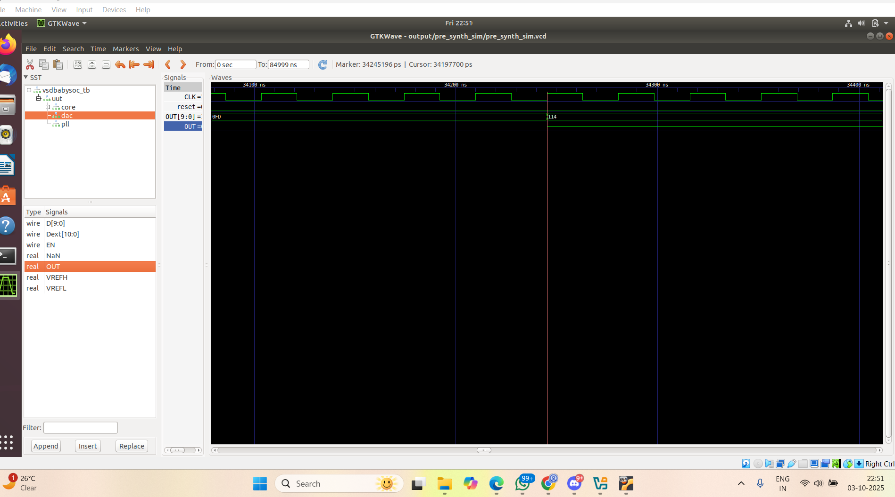

# KrishBhavsar_VSD_TAPEOUT-Week-2
# 📘 Week 2 – Theoretical Workspace (Expanded)

## Part 1 – Fundamentals of System-on-Chip (SoC)

### 1. Introduction to SoC
A **System-on-Chip (SoC)** is one of the most sophisticated forms of integrated circuits. It encapsulates the **entire functionality of an electronic system** within a single chip. Unlike traditional board-level designs where multiple ICs are interconnected, an SoC brings **processor cores, memory, input/output interfaces, analog components, and communication buses** into one silicon die.

The **primary motivation** behind SoC development is the **need for compact, power-efficient, and high-performance systems** in fields such as mobile computing, IoT devices, automotive electronics, and embedded systems. By minimizing the number of separate components, SoCs also reduce **manufacturing cost**, **latency**, and **overall power usage**, making them the backbone of modern portable and connected devices.

---

### 2. Characteristics of an SoC
- **Integration:** Combines digital, analog, mixed-signal, and often RF components.  
- **Optimization:** Tailored for specific applications (e.g., mobile SoCs focus on power efficiency, while server SoCs prioritize performance).  
- **Scalability:** SoCs can be designed with minimal modules for simple embedded devices or highly complex architectures for smartphones and AI accelerators.  
- **System-Level Design:** Unlike discrete IC design, SoC requires **co-design of hardware and software** for optimum performance.

---

### 3. Core Components of SoC
An SoC can be thought of as a **miniaturized computer system** with the following essential subsystems:

#### a. Processor Core (CPU/MCU)
- The brain of the SoC, responsible for executing instructions.  
- May be **general-purpose** (e.g., ARM Cortex, RISC-V) or **application-specific** (DSPs, AI accelerators).  
- In SoC design, multiple cores are often integrated to allow parallelism and energy-efficient task handling.

#### b. Memory
- **On-chip Memory:** Cache and SRAM for faster access.  
- **Off-chip Memory Interfaces:** DDR, LPDDR for large storage needs.  
- Efficient memory hierarchy is crucial to reduce data bottlenecks.

#### c. I/O Interfaces
- Provide connectivity to external devices.  
- Common interfaces: **UART, SPI, I²C, USB, Ethernet, GPIOs.**

#### d. Analog and Mixed-Signal Modules
- **ADC (Analog-to-Digital Converter):** Converts external analog signals into digital form for processing.  
- **DAC (Digital-to-Analog Converter):** Converts digital data back into analog signals for real-world interfacing.

#### e. Clock Management – PLL (Phase-Locked Loop)
- Ensures a stable and synchronized system clock.  
- Allows frequency multiplication/division to adapt to different subsystems’ needs.

#### f. Interconnects (Bus / Network-on-Chip)
- **Traditional Approach:** Shared system bus (e.g., AMBA, AXI).  
- **Modern Approach:** Network-on-Chip (NoC) for scalable high-bandwidth communication.

---

### 4. Advantages of SoC
- **Miniaturization:** Enables portable and wearable devices.  
- **Energy Efficiency:** Lower power usage compared to board-level integration.  
- **High Performance:** Faster internal communication and optimized data handling.  
- **Cost Efficiency:** Reduces the need for multiple discrete chips, lowering assembly cost.  
- **Reliability:** Fewer interconnects reduce hardware failures.

---

### 5. VSDBabySoC – A Learning Platform
The **VSDBabySoC** is a simplified SoC framework used in VLSI learning programs. Its purpose is to demonstrate **how different modules interact** in a small yet functional environment.

**Key Subsystems in VSDBabySoC:**
1. **Processor (RISC-V based pulpino core):** Executes simple programs.  
2. **PLL:** Provides controlled clock signals.  
3. **DAC:** Converts processed digital data into analog outputs.

This compact setup is ideal for **functional simulation, waveform analysis, and hands-on verification** without the complexity of full industrial SoCs.

---

## Part 2 – Functional Simulation and Verification of SoC

### 1. Importance of Functional Simulation
Before fabrication, SoCs undergo **simulation at RTL (Register Transfer Level)** to verify logic correctness.  
- **Goal:** Ensure that each block performs its intended function and that all modules interact properly.  
- This prevents costly design errors at later stages like synthesis and fabrication.

---

### 2. Pre-Synthesis Simulation
Pre-synthesis (behavioral) simulation focuses on validating logical behavior.

**Steps Involved:**
- Initialize inputs such as **clock, reset, and program memory.**  
- Allow the **processor** to execute its program.  
- Observe how the **DAC output** changes in response.  
- Verify whether the **PLL clock** maintains stability.

This confirms the **functional correctness of the RTL code**.

---

### 3. Testbench and Its Role
A **testbench** is a virtual environment that stimulates the SoC design with realistic inputs.

**Functions of a Testbench:**
- Generates **clock pulses** to drive the system.  
- Applies **reset conditions** to bring the design to a known initial state.  
- Feeds in **sample data** or memory initialization files.  
- Observes outputs and checks them against **expected values**.

Without a testbench, designers would have no reliable method to evaluate whether the SoC behaves correctly in different scenarios.

---

### 4. Waveform Analysis
Simulation produces **waveform files** that can be visualized using tools like **GTKWave**.

**Observed Waveforms in VSDBabySoC:**
- **CPU execution traces:** Show program counter updates, instruction fetch, decode, and execution cycles.  
- **PLL output waveform:** Confirms that the clock is phase-locked and frequency-adjusted.  
- **DAC output waveform:** Verifies digital-to-analog conversion accuracy.  
- **Reset waveforms:** Ensure that system initialization is clean and deterministic.

Waveform analysis bridges the gap between **abstract RTL code** and **observable system behavior**, offering confidence before moving forward.

---

### 5. Post-Synthesis Simulation
After synthesis, the design exists as a **gate-level netlist**.  
- This stage includes **timing delays, setup and hold constraints, and gate-level logic behavior.**  
- It is slower but critical to ensure that the design is still valid under **realistic hardware conditions.**  
- Post-synthesis simulation highlights issues like clock skews, propagation delays, and race conditions.

---

## Part 3 – Conclusion
Week 2 was a **theoretical and practical bridge** in the SoC design journey.

**Key Takeaways:**
- A solid understanding of **what constitutes an SoC** and how its subsystems interact.  
- Learning that **simulation is not just optional but mandatory** before moving to fabrication.  
- Realizing that **testbenches and waveform analysis** are essential skills in digital design verification.  
- Exposure to **VSDBabySoC** as a controlled environment that mirrors real-world SoC challenges but in a manageable form.

By completing this phase, a designer develops confidence in moving toward **hardware synthesis and physical design**, knowing that the functional intent of the design is well-verified.
# Week 2 Part 2 - Functional Modeling Laboratory

---

## Laboratory Objective

The goal of this lab is to **practice functional modeling and simulation** of the VSDBabySoC using **pre-synthesis and post-synthesis simulations**, **waveform analysis**, and **verification of functional correctness**. Students will also gain hands-on experience with **EDA tools**, **TL-Verilog**, **Verilog simulation**, and **professional documentation practices**.

---

## Table of Contents

1. [Session 1: Environment Setup](#session-1-environment-setup)
2. [Session 2: Project Preparation](#session-2-project-preparation)
3. [Session 3: Pre-synthesis Simulation](#session-3-pre-synthesis-simulation)
4. [Session 4: Waveform Analysis](#session-4-waveform-analysis)
5. [Session 5: Post-synthesis Simulation](#session-5-post-synthesis-simulation)
6. [Session 6: Results Documentation](#session-6-results-documentation)
7. [Session 7: Troubleshooting & Review](#session-7-troubleshooting--review)
8. [Appendices](#appendices)
9. [References](#references)

---

## Session 1: Environment Setup

**Objective:** Install all required tools and set up the lab environment.

### 1.1 System Requirements

**Hardware:**

* Minimum 4GB RAM (8GB recommended)
* 10GB free disk space
* Intel/AMD x64 processor

**Software:**

* Ubuntu 18.04 LTS or later
* Python 3.6+
* Git version control

### 1.2 Tool Installation

```bash
# Update system packages
sudo apt update && sudo apt upgrade -y

# Install essential development tools
sudo apt install -y build-essential git python3 python3-pip make cmake pkg-config iverilog gtkwave
```


### 1.3 Python Environment

```bash
# Create and activate virtual environment
python3 -m venv sp_env
source sp_env/bin/activate

# Install required Python packages
pip install pyyaml click sandpiper-saas
```

**Verification:**

```bash
which iverilog
which gtkwave
sandpiper-saas --version
```

**Screenshot Placeholder:** `docs/images/setup/tool-verification.png`

### 1.4 Environment Variables

```bash
echo 'export VLSI_HOME=$HOME/VLSI' >> ~/.bashrc
echo 'export PATH=$VLSI_HOME/tools/bin:$PATH' >> ~/.bashrc
source ~/.bashrc
```
GTKWave is a **waveform viewer** that visualizes simulation outputs from `.vcd` or `.fst` files. It enables signal-level debugging by showing how inputs and outputs evolve over time.

* **Role in Flow:** Debugging and waveform inspection.
* **Features:** zooming, signal grouping, cursor-based measurement, and hierarchical viewing.
* **Use Case:** Essential for confirming functional correctness and validating timing behavior.
- 
- 
- 
- 
- 
- 


---

## Session 2: Project Preparation

**Objective:** Clone VSDBabySoC repository, analyze sources, and convert TL-Verilog to Verilog.

### 2.1 Repository Cloning

```bash
mkdir -p ~/VLSI
cd ~/VLSI
git clone https://github.com/manili/VSDBabySoC.git
cd VSDBabySoC
ls -la
```

**Expected Structure:**

```
src/module/       <- Verilog/TL-Verilog sources
Makefile
README.md
output/
```

**Screenshot Placeholder:** `docs/images/setup/repo-structure.png`

### 2.2 Source Code Analysis

| File           | Purpose              | Location      |
| -------------- | -------------------- | ------------- |
| `rvmyth.tlv`   | RISC-V processor     | `src/module/` |
| `vsdbabysoc.v` | Top-level SoC        | `src/module/` |
| `avsdpll.v`    | PLL model            | `src/module/` |
| `avsddac.v`    | DAC model            | `src/module/` |
| `testbench.v`  | Simulation testbench | `src/module/` |

### 2.3 TL-Verilog to Verilog Conversion

```bash
source sp_env/bin/activate
sandpiper-saas -i ./src/module/*.tlv -o rvmyth.v --bestsv --noline -p verilog --outdir ./src/module/
ls -la src/module/rvmyth.v
```
- 
- 
- 


---

## Session 3: Pre-synthesis Simulation

**Objective:** Compile and simulate the design using Icarus Verilog.

### 3.1 Create Output Directories

```bash
mkdir -p output/pre_synth_sim output/post_synth_sim logs
```

### 3.2 Compile Verilog Sources

```bash
cd ~/VLSI/VSDBabySoC
iverilog -o output/pre_synth_sim/pre_synth_sim.out \
-DPRE_SYNTH_SIM \
-I src/include -I src/module \
src/module/testbench.v \
src/module/vsdbabysoc.v \
src/module/rvmyth.v \
src/module/avsdpll.v \
src/module/avsddac.v
```


### 3.3 Simulation Execution

```bash
cd output/pre_synth_sim
./pre_synth_sim.out
ls -la *.vcd
```

**Simulation Output Example:**

```
VCD info: dumpfile pre_synth_sim.vcd opened for output.
Time    Reset  CLK    RV_TO_DAC    DAC_OUT
0       1      0      xxxxxxxxxx   0.000000
...
Simulation completed successfully
```
- 
- 


**Screenshot Placeholder:** `docs/images/terminal/simulation-execution.png`

---

## Session 4: Waveform Analysis

**Objective:** Analyze simulation waveforms using GTKWave.

### 4.1 Launch GTKWave

```bash
gtkwave output/pre_synth_sim/pre_synth_sim.vcd &
```

### 4.2 Signal Selection

* Add signals: `CLK`, `reset`, `OUT[9:0]`, `dac.OUT`
* DAC output: Right-click → Data Format → Analog → Step

**Screenshot Placeholder:** `docs/images/waveforms/signal-selection-process.png`

### 4.3 Waveform Analysis

| Signal     | Purpose          | Expected Behavior                     |
| ---------- | ---------------- | ------------------------------------- |
| `CLK`      | System clock     | Square wave, ~100MHz                  |
| `reset`    | System reset     | High initially, then low              |
| `OUT[9:0]` | Digital data bus | Changing values after reset           |
| `dac.OUT`  | Analog output    | Step waveform following digital input |

**Measurements Checklist:**

* Clock period: 10 ns
* Reset duration: ~50 ns
* Data transitions: ≥15
* Analog output range: 0V → 3.3V


- 
- 
---

## Session 5: Post-synthesis Simulation

**Objective:** Attempt synthesis and document known issues.

### 5.1 Synthesis Attempt

```bash
source sp_env/bin/activate
make synth
```

### 5.2 Known Issue

```
ERROR: Assert `p != NULL' failed in kernel/yosys.cc:453.
```


### 5.3 Alternative Approach

* Use pre-synthesized netlist: `output/synth/vsdbabysoc.synth.v`
* Continue waveform analysis and lab documentation

---

## Session 6: Results Documentation

**Objective:** Collect all logs, screenshots, and explanations.

```bash
mkdir -p docs/lab/simulation-logs
cp output/pre_synth_sim/*.log docs/lab/simulation-logs/
cp output/pre_synth_sim/simulation_output.txt docs/lab/simulation-logs/
cp synthesis.log docs/lab/simulation-logs/synthesis_error.log
```

**Deliverables Checklist:**

* Simulation logs
* GTKWave screenshots
* Technical explanations
* Post-synthesis error documentation

---

## Session 7: Troubleshooting & Review

**Common Issues & Fixes:**

* `sandpiper-saas: command not found` → activate env, reinstall
* `iverilog: command not found` → install Icarus Verilog
* No VCD → verify `$dumpfile` and `$dumpvars` in testbench
* Analog waveform missing → select `dac.OUT` in GTKWave, set Analog → Step
* Post-synthesis errors → document, proceed with pre-synth results

**Review Questions:**

1. Difference between pre-synthesis and post-synthesis simulation?
2. How does DAC output correspond to processor digital bus?
3. Why is waveform analysis important?

---

## Appendices

### Appendix A: Essential Commands

```bash
source sp_env/bin/activate
sandpiper-saas -i *.tlv -o *.v
iverilog -o sim.out *.v
./sim.out
gtkwave file.vcd &
make clean
```

### Appendix B: File Locations

```
~/VLSI/VSDBabySoC/
├── src/module/           <- Source Verilog files
├── output/pre_synth_sim/ <- Pre-synthesis results
├── docs/images/          <- Screenshots
└── logs/                 <- Log files
```

### Appendix C: Success Criteria

* Successful Icarus Verilog compilation
* VCD file generation & GTKWave visualization
* Correct waveforms for clock, reset, data bus, DAC
* Complete documentation with screenshots

---

## References

* [VSDBabySoC Project](https://github.com/manili/VSDBabySoC)
* [Icarus Verilog Documentation](http://iverilog.icarus.com/)
* [GTKWave User Guide](http://gtkwave.sourceforge.net/gtkwave.pdf)
* [TL-Verilog Documentation](https://www.redwoodeda.com/tl-verilog)
* RISC-V ISA Specification: [riscv.org](https://riscv.org/specifications/)
* Mixed-Signal System Integration & Functional Verification textbooks

---

## Week 2 Achievement Summary

**Theoretical Mastery:**

* SoC design principles
* VSDBabySoC architecture analysis
* Professional documentation skills

**Practical Skills:**

* Icarus Verilog & GTKWave proficiency
* TL-Verilog conversion
* Waveform analysis and debugging

**Technical Accomplishments:**

* Pre-synthesis functional verification
* Complete simulation environment setup
* DAC analog output verification

**Professional Development:**

* Systematic troubleshooting
* Technical reporting & documentation
* Lab session management

**Week 2 Status: COMPLETE ✅**
